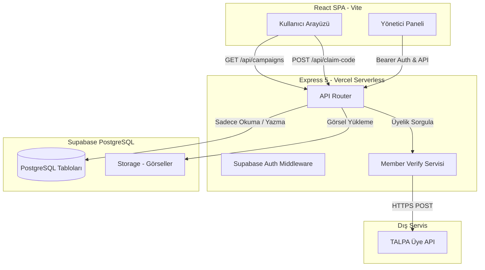
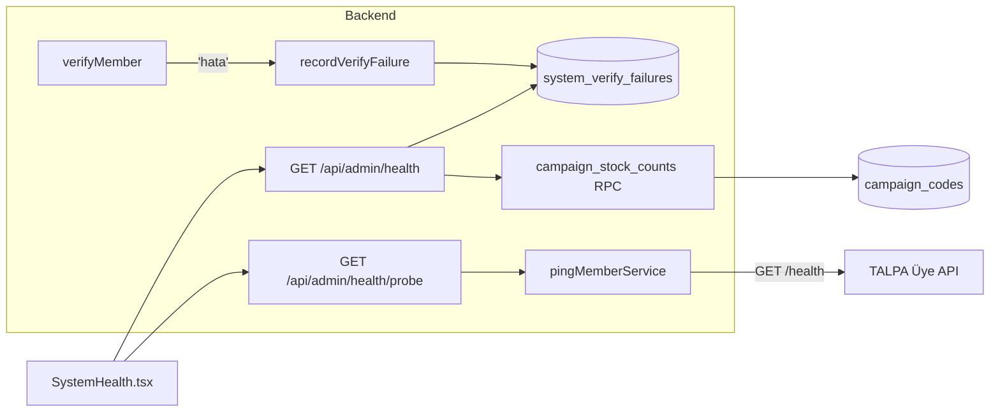

# Sistem Mimarisi ve Kod Dağıtım Akışı

**Summary**: TALPA Kampanyaları uygulamasının üç katmanlı sistem mimarisi, kod dağıtım/talep iş akışı (claim flow) ve optimistik kilit tabanlı eşzamanlılık kontrolü.
**Tags**: #architecture #claim-flow #concurrency #cas #talpa
**Created**: 2026-05-26T12:35:00+03:00
**Last Updated**: 2026-06-07T12:00:00+03:00

---

## Content

Sistem, **React SPA** (Single Page Application) istemcisi, **Express** API katmanı ve **Supabase (PostgreSQL)** veri katmanından oluşan üç katmanlı bir yapıya sahiptir. Güvenlik kuralları gereği, tüm yazma ve veri güncelleme operasyonları sunucu tarafında (Express) korumalı olarak yürütülür.

---

## 🏗️ Genel Mimari Yapı



---

## 🔑 Kod Dağıtım ve Alma Akışı (Claim Flow)

Sistemdeki en kritik iş mantığı, bir üyenin bir kampanyadan indirim kodu talep etmesidir (`POST /api/claim-code`). Birden fazla kullanıcının aynı anda kod talep etmesi durumunda yarış durumlarını (race condition) önlemek ve dernek aidat kurallarını uygulamak için aşağıdaki adımlar takip edilir:

```mermaid
sequenceDiagram
    autonumber
    actor Uye as TALPA Üyesi
    participant Client as React İstemci
    participant Server as Express Sunucu
    participant MemberAPI as TALPA Üye API
    participant DB as Supabase DB

    Uye->>Client: TCKN girer ve "Kod Al" butonuna basar
    Client->>Server: POST /api/claim-code { tc_no, campaign_slug }
    
    rect rgb(20, 30, 50)
        Note over Server, DB: 1. Kampanya Kontrolü
        Server->>DB: Kampanyayı slug ile çek (is_active, valid_until, max_codes_per_user)
        DB-->>Server: Kampanya Detayları
        alt Kampanya Yok veya Aktif Değil veya Süresi Geçmiş
            Server-->>Client: 404 / 400 Hata Mesajı
        end
    end

    rect rgb(20, 50, 30)
        Note over Server, MemberAPI: 2. Üyelik & Borç Kontrolü
        Server->>MemberAPI: verifyMember(tcNo, campaignSlug)
        MemberAPI-->>Server: Durum ('uye' | 'borclu' | 'degil' | 'hata')
        alt Durum: 'hata' (servise ulaşılamadı)
            Server->>DB: recordVerifyFailure('claim') (best-effort)
            Server-->>Client: 503 "Servise ulaşılamıyor, birkaç dakika sonra tekrar deneyin."
        else Durum: 'borclu'
            Server-->>Client: 403 "Aidat borçları sebebiyle kampanya katılımınız sınırlandırılmıştır."
        else Durum: 'degil'
            Server-->>Client: 403 "TALPA üyelik kaydınıza ulaşılamamıştır."
        end
    end

    rect rgb(20, 30, 50)
        Note over Server, DB: 3. Limit Kontrolü
        Server->>DB: claimed_by_tc = TCKN olan kodları getir
        DB-->>Server: Alınan Kod Listesi
        alt Alınan Kod Sayısı >= max_codes_per_user
            Server-->>Client: 200 { alreadyClaimed: true, codes }
        end
    end

    rect rgb(50, 40, 20)
        Note over Server, DB: 4. Kod Tahsisi & Kilit
        Server->>DB: is_used = false olan ilk kodu seç
        DB-->>Server: Seçilen Kod Satırı (id, code)
        alt Dağıtılacak Kod Kalmadıysa
            Server-->>Client: 404 "Bu kampanyada dağıtılacak kod kalmamıştır."
        end
        Server->>DB: UPDATE campaign_codes SET is_used=true, claimed_by_tc=TCKN WHERE id=kod_id AND is_used=false
        DB-->>Server: Güncellenen Kod (Varsa)
        alt Optimistik Kilit Çakışması (Kod başkası tarafından alındıysa)
            Server-->>Client: 409 "Kod alınırken çakışma oluştu, lütfen tekrar deneyin."
        end
    end

    rect rgb(20, 30, 50)
        Note over Server, DB: 5. Talep Kaydı
        Server->>DB: campaign_claims tablosuna yeni satır insert et (campaign_id, tc_no)
        DB-->>Server: Insert Başarılı (Unique Constraint korumalı)
    end

    Server-->>Client: 200 { alreadyClaimed: false, code, limitReached }
    Client->>Uye: Başarı animasyonu ile kodu gösterir & kopyalama seçeneği sunar
```



---

## 🔒 Eşzamanlılık Kontrolü: Atomik Tahsis (Postgres RPC)

Aynı anda yüzlerce üyenin indirim kodu almaya çalıştığı pik zamanlarda iki risk vardır:
1. Aynı kodun **iki farklı üyeye** tahsis edilmesi.
2. **Aynı üyenin** eşzamanlı isteklerle `max_codes_per_user` limitini aşması (örn. çift tıklama).

Eski sürümde yalnızca uygulama katmanında Compare-And-Swap (CAS) kullanılıyordu; bu (1)'i çözüyor ama (2)'yi çözmüyordu — limit kontrolü ile tahsis arasındaki yarış nedeniyle bir üye birden fazla kod alabiliyordu. Bu yüzden tüm tahsis mantığı **tek bir PostgreSQL fonksiyonuna** (`public.claim_campaign_code`) taşınmıştır. Fonksiyon tek bir transaction içinde çalışır:

```sql
-- 1) Aynı (kampanya, üye) için eşzamanlı çağrıları serileştir
perform pg_advisory_xact_lock(hashtextextended(p_campaign_id::text || ':' || p_tc_no, 0));

-- 2) Üyenin mevcut kodlarını say; limit doluysa mevcut kodları döndür
-- 3) Boş bir kodu çekişmesiz kilitle (farklı üyeler farklı satır alır)
select id, code from campaign_codes
  where campaign_id = p_campaign_id and is_used = false
  order by id for update skip locked limit 1;

-- 4) Kodu işaretle ve claim kaydını yaz (on conflict do nothing)
```

### Neden Güvenli?
* **`pg_advisory_xact_lock`** aynı üye + kampanya için gelen istekleri **seri** hale getirir; böylece limit sayımı ile tahsis arasındaki yarış tamamen kapanır (bir üye limitten fazla kod alamaz).
* **`FOR UPDATE SKIP LOCKED`** farklı üyelerin aynı kod satırı için kilitlenmesini önler — her istek boştaki bir sonraki kodu alır, kimse beklemez ve aynı kod iki kez verilmez.
* Limit kontrolü, kod tahsisi ve `campaign_claims` kaydı **aynı transaction'da atomiktir**; ara bir hata olursa hepsi geri alınır (eski sürümdeki "sessizce yutulan claim insert" sorunu da ortadan kalkar).

Express tarafı (`claim.ts`) yalnızca kampanya/üyelik kontrollerini yapıp fonksiyonu çağırır ve dönen `status` değerine göre yanıt üretir:
```typescript
const { data: rpcData } = await supabaseAdmin.rpc('claim_campaign_code', {
  p_campaign_id: campaign.id,
  p_tc_no: tc_no,
  p_max_codes: maxCodes,
});
// status: 'claimed' | 'already_claimed' | 'no_codes'
```

> [!NOTE]
> Fonksiyon `SECURITY INVOKER` (varsayılan) çalışır ve `anon`/`authenticated` rollerinden `EXECUTE` yetkisi alınmıştır. Yalnızca backend `service_role` ile çağrılır.

---

## 🩺 Sistem Sağlığı ve Gözlemlenebilirlik (Observability)

Kampanyalar TALPA'nın toplu e-postasıyla duyurulduğu için tüm üyeler **aynı anda** sisteme girer (thundering herd). Tek bir yöneticinin en büyük riski **sessiz arıza**dır; bu yüzden sisteme bir "sinir sistemi" eklenmiştir. Üç sinyal toplanır:



1. **Pasif hata günlüğü:** Her `hata` durumu `recordVerifyFailure` ile `system_verify_failures`'a yazılır (best-effort; yazılamazsa istek akışı bozulmaz). Sağlık ekranı son 30 dakikadaki hata sayısına bakar.
2. **Aktif yoklama (probe):** `pingMemberService`, dış servisin `/health` ucunu 6 sn timeout'la GET'ler — iş mantığına dokunmadan "servis + DB ayakta mı" sorusunu yanıtlar.
3. **Stok & nabız:** `campaign_stock_counts()` RPC kampanya başına `total`/`used` sayımını tek sorguda döner (hem sağlık ekranı hem public `/api/campaigns` aynı RPC'yi kullanır, N+1 yok). "Nabız" son kod tarihi + bugün dağıtılan adet.

> [!NOTE]
> **Renk mantığı (kasıtlı):** Ana ışık **yalnızca dış servis çökükse KIRMIZI** olur; stok tükenmesi **SARI** kalır (kırmızının alarm değerini korumak için). `/health` henüz yayında değilse panel servis durumunu kırmızı değil **gri** ("yayında değil") gösterir.

---

## 🛡️ Hata ve Olağanüstü Durum Yönetimi

1. **TALPA API Ağ/Servis Hataları:** Üye doğrulama API'si çökerse, 401/5xx dönerse veya ağ/timeout (8 sn) alınırsa, sistem artık `"degil"` **dönmez** — bu gerçek üyeleri haksız yere reddediyordu. Bunun yerine `"hata"` durumu üretilir; claim/my-codes uç noktaları **503** döner (kullanıcı "tekrar deneyin" görür), olay `system_verify_failures` tablosuna pasif kaydedilir ve [Sistem Sağlık Ekranı](admin.md#-sistem-sa%C4%9Fl%C4%B1%C4%9F%C4%B1-paneli)'nde görünür. API geçici olarak aşırı yüklenirse (429 Rate Limit), arka planda üstel geri çekilme (exponential backoff) ile 3 defaya kadar yeniden deneme (retry) gerçekleştirilir; tüm denemeler tükenirse yine `"hata"` döner. Ayrıntı: [member-verification.md](member-verification.md).
2. **Atomik Tutarlılık:** Kod tahsisi ve `campaign_claims` kaydı artık `claim_campaign_code` fonksiyonu içinde **aynı transaction'da** yapılır. Herhangi bir adım başarısız olursa transaction tamamen geri alınır; bu nedenle "kod işaretlendi ama claim yazılamadı" gibi yarım durumlar oluşmaz. Bir üye limitine ulaşmışsa fonksiyon yeni kod üretmeden mevcut kodlarını (`already_claimed`) döndürür.
3. **Hız Sınırı (Rate Limit):** `/api/claim-code` ve `/api/my-codes` uç noktaları IP başına dakikada 10 istekle sınırlıdır (`express-rate-limit`). Bu, T.C. enumerasyonunu ve dış üye API'sinin kötüye kullanılmasını zorlaştırır. Aşıldığında **429** döner.
4. **Sunucu Tarafı T.C. Doğrulaması:** İstemci doğrulamasına güvenilmez; `tc_no` sunucuda da algoritmik olarak doğrulanır (`server/lib/validateTc.ts`), geçersizse **400** döner.

## Related Notes

- [[README]]
- [[api]]
- [[database]]
- [[member-verification]]
