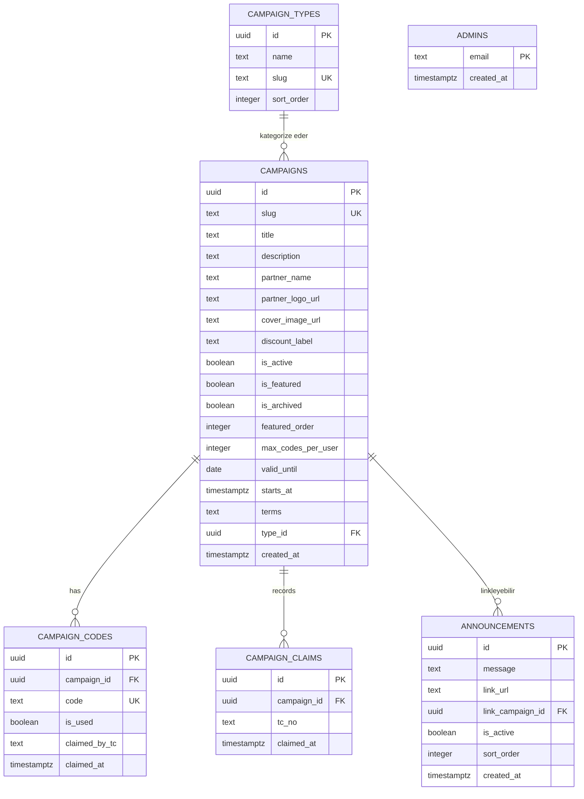

# Veritabanı Şeması ve İlişkiler

**Summary**: Supabase (PostgreSQL) veritabanı şeması, tablo yapıları (DDL), ERD, atomik tahsis/stok RPC'leri, indeksler ve RLS politikaları. Tür (campaign_types) ve duyuru (announcements) tablolarıyla güncel.
**Tags**: #database #schema #ddl #rls #supabase #postgres
**Created**: 2026-05-26T12:35:00+03:00
**Last Updated**: 2026-06-08T16:00:00+03:00

---

## Content

Sistem, Supabase tarafından barındırılan bir **PostgreSQL** veritabanı kullanır. İlişkisel veri modeli; kampanyaları, türlerini, indirim kodlarını, üye taleplerini ve duyuruları güvenli biçimde ilişkilendirir.

---

## 🗄️ Tablo İlişkileri (ERD)



> [!NOTE]
> `admins` (yönetici allowlist) ve `system_verify_failures` (sağlık ekranının doğrulama-hatası günlüğü) kampanya tablolarıyla ilişkisizdir. Ayrıca aynı Supabase projesi, dış TALPA Üye Doğrulama API'sine ait `members`, `member_campaign_access` vb. tabloları da barındırır — bunlar **bu uygulama tarafından yazılmaz**, dış servisin domain'ine aittir.

---

## 📊 Tablo Tanımları (PostgreSQL DDL)

```sql
-- 1. Kampanya Türleri (vitrin sekmeleri + kategorizasyon)
CREATE TABLE campaign_types (
    id UUID PRIMARY KEY DEFAULT gen_random_uuid(),
    name TEXT NOT NULL,
    slug TEXT UNIQUE NOT NULL,
    sort_order INT DEFAULT 0 NOT NULL
);

-- 2. Campaigns
CREATE TABLE campaigns (
    id UUID PRIMARY KEY DEFAULT gen_random_uuid(),
    slug TEXT UNIQUE NOT NULL,
    title TEXT NOT NULL,
    description TEXT,
    partner_name TEXT,
    partner_logo_url TEXT,
    cover_image_url TEXT,
    discount_label TEXT NOT NULL,
    is_active BOOLEAN DEFAULT false NOT NULL,
    is_featured BOOLEAN DEFAULT false NOT NULL,
    is_archived BOOLEAN DEFAULT false NOT NULL,    -- arşiv (vitrinden çıkar, salt-okunur)
    featured_order INT DEFAULT 0,
    max_codes_per_user INT DEFAULT 1 NOT NULL,
    valid_until DATE,                              -- bitiş günü (dahil)
    starts_at TIMESTAMPTZ,                          -- başlangıç; gelecekse "Yakında"
    terms TEXT,
    type_id UUID REFERENCES campaign_types(id),    -- tür (form varsayılan türe düşürür)
    created_at TIMESTAMPTZ DEFAULT now() NOT NULL
);

-- 3. Campaign Codes — code TÜM kampanyalarda benzersizdir (kasıtlı; global tekil)
CREATE TABLE campaign_codes (
    id UUID PRIMARY KEY DEFAULT gen_random_uuid(),
    campaign_id UUID NOT NULL REFERENCES campaigns(id) ON DELETE CASCADE,
    code TEXT UNIQUE NOT NULL,
    is_used BOOLEAN DEFAULT false NOT NULL,
    claimed_by_tc TEXT,
    claimed_at TIMESTAMPTZ
);

-- 4. Campaign Claims
CREATE TABLE campaign_claims (
    id UUID PRIMARY KEY DEFAULT gen_random_uuid(),
    campaign_id UUID NOT NULL REFERENCES campaigns(id) ON DELETE CASCADE,
    tc_no TEXT NOT NULL,
    claimed_at TIMESTAMPTZ DEFAULT now() NOT NULL,
    CONSTRAINT unique_campaign_user UNIQUE (campaign_id, tc_no)
);

-- 5. Announcements (anasayfa duyuru şeridi)
CREATE TABLE announcements (
    id UUID PRIMARY KEY DEFAULT gen_random_uuid(),
    message TEXT NOT NULL,
    link_url TEXT,                                 -- dış URL (opsiyonel)
    link_campaign_id UUID REFERENCES campaigns(id) ON DELETE SET NULL, -- iç kampanya linki
    is_active BOOLEAN DEFAULT false NOT NULL,
    sort_order INT DEFAULT 0 NOT NULL,
    created_at TIMESTAMPTZ DEFAULT now() NOT NULL
);

-- 6. Admins (yönetici allowlist)
CREATE TABLE admins (
    email TEXT PRIMARY KEY,
    created_at TIMESTAMPTZ DEFAULT now() NOT NULL
);
ALTER TABLE admins ENABLE ROW LEVEL SECURITY; -- policy yok => sadece service_role

-- 7. Doğrulama Hatası Günlüğü (Sağlık Ekranı)
CREATE TABLE system_verify_failures (
    id UUID PRIMARY KEY DEFAULT gen_random_uuid(),
    created_at TIMESTAMPTZ DEFAULT now() NOT NULL,
    source TEXT NOT NULL,        -- 'claim' | 'my-codes'
    reason TEXT
);
ALTER TABLE system_verify_failures ENABLE ROW LEVEL SECURITY;
CREATE INDEX idx_verify_failures_created_at ON system_verify_failures(created_at DESC);
```

> [!IMPORTANT]
> **Kodlar global tekildir.** `campaign_codes.code` üzerindeki UNIQUE kısıt **tüm kampanyaları** kapsar (per-campaign değil; kasıtlı). Toplu/tek kod yüklemede bu nedenle `ON CONFLICT (code) DO NOTHING` (upsert/ignoreDuplicates) kullanılır — başka bir kampanyada zaten var olan bir kod sessizce atlanır, tüm yükleme düşmez.

---

## 🔧 Atomik Tahsis Fonksiyonu (`claim_campaign_code`)

Kod tahsisindeki yarış durumlarını (aynı kodun iki üyeye verilmesi **ve** bir üyenin limiti aşması) tamamen kapatmak için tüm tahsis mantığı tek transaction'da çalışan bir RPC'ye taşınmıştır. Detay: [architecture.md](architecture.md#-eşzamanlılık-kontrolü-atomik-tahsis-postgres-rpc).

```sql
CREATE OR REPLACE FUNCTION public.claim_campaign_code(
    p_campaign_id uuid, p_tc_no text, p_max_codes int
) RETURNS jsonb LANGUAGE plpgsql AS $$
DECLARE v_existing text[]; v_count int; v_code_id uuid; v_code text;
BEGIN
    PERFORM pg_advisory_xact_lock(hashtextextended(p_campaign_id::text || ':' || p_tc_no, 0));

    SELECT coalesce(array_agg(code), array[]::text[]), count(*) INTO v_existing, v_count
    FROM public.campaign_codes WHERE campaign_id = p_campaign_id AND claimed_by_tc = p_tc_no;

    IF v_count >= p_max_codes THEN
        RETURN jsonb_build_object('status', 'already_claimed', 'codes', to_jsonb(v_existing));
    END IF;

    SELECT id, code INTO v_code_id, v_code
    FROM public.campaign_codes
    WHERE campaign_id = p_campaign_id AND is_used = false
    ORDER BY id FOR UPDATE SKIP LOCKED LIMIT 1;

    IF v_code_id IS NULL THEN
        RETURN jsonb_build_object('status', 'no_codes', 'codes', to_jsonb(v_existing));
    END IF;

    UPDATE public.campaign_codes
      SET is_used = true, claimed_by_tc = p_tc_no, claimed_at = now() WHERE id = v_code_id;

    INSERT INTO public.campaign_claims (campaign_id, tc_no)
    VALUES (p_campaign_id, p_tc_no) ON CONFLICT (campaign_id, tc_no) DO NOTHING;

    v_existing := v_existing || v_code; v_count := v_count + 1;
    RETURN jsonb_build_object('status', 'claimed', 'code', v_code,
        'codes', to_jsonb(v_existing), 'limit_reached', (v_count >= p_max_codes));
END;
$$;

REVOKE ALL ON FUNCTION public.claim_campaign_code(uuid, text, int) FROM anon, authenticated;
```

**Dönüş `status`:** `claimed` · `already_claimed` · `no_codes`.

---

## 📦 Toplu Stok Sayım Fonksiyonu (`campaign_stock_counts`)

Hem public vitrin uçları (`/api/campaigns`, `/campaigns/archive`, `/campaigns/:slug`) hem admin `/api/admin/health` kampanya başına `total`/`used` ister. Bu sayım tek set-based fonksiyona taşınmıştır (N+1 yok):

```sql
CREATE OR REPLACE FUNCTION public.campaign_stock_counts()
RETURNS TABLE(campaign_id uuid, total bigint, used bigint)
LANGUAGE sql STABLE SET search_path TO '' AS $$
  select campaign_id, count(*)::bigint,
         count(*) filter (where is_used)::bigint
  from public.campaign_codes group by campaign_id;
$$;
```
* Sunucu dönen satırları `Map<campaign_id, {total, used}>`'e koyar; `remaining = total - used`, düşük stok eşiği `max(ceil(total*0.15), 25)`.

> [!NOTE]
> Admin `/api/admin/campaigns` (liste) ve `/api/admin/campaigns/:id` (detay) ise her kampanya için ayrı `count` sorgusu kullanır (admin tarafı düşük trafiklidir; RPC yalnız yüksek-trafikli vitrin/sağlık uçlarında zorunludur).

---

## ⚡ İndeks Tanımlamaları

```sql
CREATE UNIQUE INDEX idx_campaigns_slug ON campaigns(slug);
CREATE INDEX idx_campaigns_active_featured ON campaigns(is_active, is_featured, featured_order DESC);
CREATE INDEX idx_campaigns_type ON campaigns(type_id);
-- Claim akışındaki en kritik sorgu (boş kod seçimi):
CREATE INDEX idx_codes_lookup ON campaign_codes(campaign_id, is_used) WHERE is_used = false;
CREATE INDEX idx_codes_claimed_by ON campaign_codes(campaign_id, claimed_by_tc);
CREATE INDEX idx_announcements_active ON announcements(is_active, sort_order);
```

---

## 🔒 Güvenlik Kuralları (RLS & Policies)

> [!IMPORTANT]
> API Sunucusu veritabanına `SUPABASE_SERVICE_KEY` ile bağlanır; bu anahtar `service_role` yetkisiyle tüm RLS politikalarını **bypass eder**. Frontend bu tabloları anon istemciyle **doğrudan sorgulamaz** (tüm veri Express üzerinden akar; istemci yalnızca `supabase.auth.*` ve signed-URL yükleme kullanır).

> [!NOTE]
> **RLS durumu:** `campaigns`, `campaign_codes`, `campaign_claims`, `campaign_types`, `announcements`, `admins` ve `system_verify_failures` tablolarında RLS **etkindir**; ek policy tanımlanmaz (anon/authenticated için deny-by-default, `service_role` bypass eder). Yeni eklenen `campaign_types` ve `announcements` tablolarında da aynı kural geçerlidir:
> ```sql
> ALTER TABLE campaign_types ENABLE ROW LEVEL SECURITY;
> ALTER TABLE announcements  ENABLE ROW LEVEL SECURITY;
> ```

## Related Notes

- [[README]]
- [[architecture]]
- [[api]]
