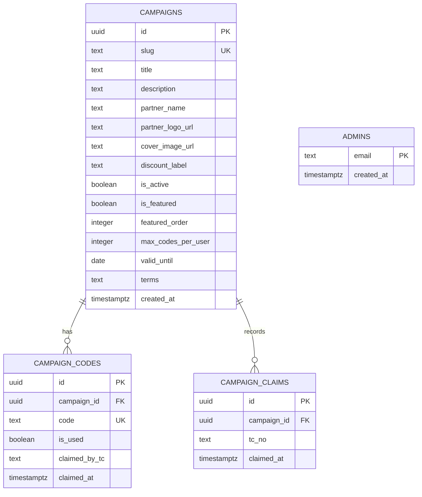

# Veritabanı Şeması ve İlişkiler

**Summary**: Supabase (PostgreSQL) veritabanı şeması, tablo yapıları (DDL), ERD diyagramı, indeks optimizasyonları ve Row Level Security (RLS) politikaları.
**Tags**: #database #schema #ddl #rls #supabase #postgres
**Created**: 2026-05-26T12:35:00+03:00
**Last Updated**: 2026-05-26T12:35:00+03:00

---

## Content

Sistem, Supabase tarafından barındırılan bir **PostgreSQL** veritabanı kullanır. İlişkisel veri modeli, kampanyaları, indirim kodlarını ve üye taleplerini güvenli bir şekilde ilişkilendirir.

---

## 🗄️ Tablo İlişkileri (ERD)



> [!NOTE]
> `admins` tablosu (yönetici allowlist) kampanya tablolarıyla ilişkisizdir; yetkilendirme için ayrı durur. Ayrıca aynı Supabase projesi, TALPA Üye Doğrulama API'sine ait `members`, `member_campaign_access`, `member_lookup_log` ve `campaign_whitelist` tablolarını da barındırır — bunlar bu uygulama tarafından yazılmaz, dış üye servisinin domain'ine aittir.

---

## 📊 Tablo Tanımları (PostgreSQL DDL)

Supabase veritabanında tabloları oluşturmak için aşağıdaki SQL betiklerini sırasıyla SQL Editör üzerinde çalıştırabilirsiniz:

```sql
-- 1. Campaigns Tablosu
CREATE TABLE campaigns (
    id UUID PRIMARY KEY DEFAULT gen_random_uuid(),
    slug TEXT UNIQUE NOT NULL,
    title TEXT NOT NULL,
    description TEXT,
    partner_name TEXT,
    partner_logo_url TEXT,
    cover_image_url TEXT,
    discount_label TEXT NOT NULL,
    is_active BOOLEAN DEFAULT false NOT NULL,
    is_featured BOOLEAN DEFAULT false NOT NULL,
    featured_order INT DEFAULT 0,
    max_codes_per_user INT DEFAULT 1 NOT NULL,
    valid_until DATE,
    terms TEXT,
    created_at TIMESTAMPTZ DEFAULT now() NOT NULL
);

-- 2. Campaign Codes Tablosu
CREATE TABLE campaign_codes (
    id UUID PRIMARY KEY DEFAULT gen_random_uuid(),
    campaign_id UUID NOT NULL REFERENCES campaigns(id) ON DELETE CASCADE,
    code TEXT UNIQUE NOT NULL,
    is_used BOOLEAN DEFAULT false NOT NULL,
    claimed_by_tc TEXT,
    claimed_at TIMESTAMPTZ
);

-- 3. Campaign Claims Tablosu
CREATE TABLE campaign_claims (
    id UUID PRIMARY KEY DEFAULT gen_random_uuid(),
    campaign_id UUID NOT NULL REFERENCES campaigns(id) ON DELETE CASCADE,
    tc_no TEXT NOT NULL,
    claimed_at TIMESTAMPTZ DEFAULT now() NOT NULL,
    -- Kompozit Tekillik: Bir üye aynı kampanyaya yalnızca bir kez claim kaydı girebilir
    CONSTRAINT unique_campaign_user UNIQUE (campaign_id, tc_no)
);

-- 4. Admins Tablosu (Yönetici allowlist)
-- requireAdmin middleware'i, doğrulanan Supabase kullanıcısının e-postasını
-- bu tabloda arar. Yalnızca burada kayıtlı e-postalar /api/admin/* erişebilir.
CREATE TABLE admins (
    email TEXT PRIMARY KEY,
    created_at TIMESTAMPTZ DEFAULT now() NOT NULL
);
ALTER TABLE admins ENABLE ROW LEVEL SECURITY; -- policy yok => sadece service_role okur
```

---

## 🔧 Atomik Tahsis Fonksiyonu (`claim_campaign_code`)

Kod tahsisindeki yarış durumlarını (aynı kodun iki üyeye verilmesi **ve** bir üyenin limiti aşması) tamamen kapatmak için tüm tahsis mantığı tek bir transaction'da çalışan bir RPC fonksiyonuna taşınmıştır. Detaylı açıklama için [architecture.md](architecture.md#-eşzamanlılık-kontrolü-atomik-tahsis-postgres-rpc).

```sql
CREATE OR REPLACE FUNCTION public.claim_campaign_code(
    p_campaign_id uuid,
    p_tc_no text,
    p_max_codes int
) RETURNS jsonb
LANGUAGE plpgsql
AS $$
DECLARE
    v_existing text[];
    v_count int;
    v_code_id uuid;
    v_code text;
BEGIN
    -- Aynı üye + kampanya için eşzamanlı çağrıları serileştir
    PERFORM pg_advisory_xact_lock(hashtextextended(p_campaign_id::text || ':' || p_tc_no, 0));

    SELECT coalesce(array_agg(code), array[]::text[]), count(*)
      INTO v_existing, v_count
    FROM public.campaign_codes
    WHERE campaign_id = p_campaign_id AND claimed_by_tc = p_tc_no;

    IF v_count >= p_max_codes THEN
        RETURN jsonb_build_object('status', 'already_claimed', 'codes', to_jsonb(v_existing));
    END IF;

    SELECT id, code INTO v_code_id, v_code
    FROM public.campaign_codes
    WHERE campaign_id = p_campaign_id AND is_used = false
    ORDER BY id FOR UPDATE SKIP LOCKED LIMIT 1;

    IF v_code_id IS NULL THEN
        RETURN jsonb_build_object('status', 'no_codes', 'codes', to_jsonb(v_existing));
    END IF;

    UPDATE public.campaign_codes
    SET is_used = true, claimed_by_tc = p_tc_no, claimed_at = now()
    WHERE id = v_code_id;

    INSERT INTO public.campaign_claims (campaign_id, tc_no)
    VALUES (p_campaign_id, p_tc_no)
    ON CONFLICT (campaign_id, tc_no) DO NOTHING;

    v_existing := v_existing || v_code;
    v_count := v_count + 1;

    RETURN jsonb_build_object(
        'status', 'claimed', 'code', v_code,
        'codes', to_jsonb(v_existing),
        'limit_reached', (v_count >= p_max_codes)
    );
END;
$$;

-- Yalnızca backend (service_role) çağırır
REVOKE ALL ON FUNCTION public.claim_campaign_code(uuid, text, int) FROM anon, authenticated;
```

**Dönüş `status` değerleri:** `claimed` (yeni kod verildi, `limit_reached` ile birlikte) · `already_claimed` (limit dolu, mevcut kodlar döner) · `no_codes` (stok bitti).

---

## ⚡ İndeks Tanımlamaları ve Optimizasyon

Veritabanının hızlı yanıt vermesi için kritik alanlarda şu indekslerin (Indexes) oluşturulması önerilir:

```sql
-- Kampanya sorgularını hızlandırmak için slug indeksi
CREATE UNIQUE INDEX idx_campaigns_slug ON campaigns(slug);

-- Aktif ve öne çıkan kampanyaları hızlı sıralamak için
CREATE INDEX idx_campaigns_active_featured ON campaigns(is_active, is_featured, featured_order DESC);

-- Kod dağıtım akışında (Claim Flow) en kritik sorgu için:
-- SELECT ... FROM campaign_codes WHERE campaign_id = $1 AND is_used = false LIMIT 1
CREATE INDEX idx_codes_lookup ON campaign_codes(campaign_id, is_used) WHERE is_used = false;

-- Üyenin daha önce aldığı kodları sorgulamak için
CREATE INDEX idx_codes_claimed_by ON campaign_codes(campaign_id, claimed_by_tc);
```

---

## 🔒 Güvenlik Kuralları (RLS & Policies)

Supabase üzerinde veri güvenliğini sağlamak için RLS (Row Level Security) politikalarının aktifleştirilmesi gerekir:

```sql
-- Tablolarda RLS'i etkinleştir
ALTER TABLE campaigns ENABLE ROW LEVEL SECURITY;
ALTER TABLE campaign_codes ENABLE ROW LEVEL SECURITY;
ALTER TABLE campaign_claims ENABLE ROW LEVEL SECURITY;

-- 1. Campaigns Politikaları: Herkes aktif kampanyaları okuyabilir
CREATE POLICY "Public Read Active Campaigns" ON campaigns
    FOR SELECT
    USING (is_active = true);

-- Yöneticiler her şeyi yapabilir (service_role otomatik olarak bypass eder, RLS sadece anon/authenticated rollerini bağlar)
-- API Sunucusu service_role anahtarı ile bağlandığından RLS kurallarından etkilenmez.
-- Ancak anonim (istemci) tarafının kodları okuması tamamen engellenmelidir.

-- 2. Campaign Codes Politikaları: Anonim erişim tamamen kapalı
-- (Sorgular sunucu tarafından backend'de service_role ile yürütülür, politikaya gerek yoktur).
CREATE POLICY "Admin All Access Codes" ON campaign_codes
    USING (true)
    WITH CHECK (true);

-- 3. Campaign Claims Politikaları: Anonim erişim tamamen kapalı
CREATE POLICY "Admin All Access Claims" ON campaign_claims
    USING (true)
    WITH CHECK (true);
```
> [!IMPORTANT]
> API Sunucusu veritabanına bağlanırken `SUPABASE_SERVICE_KEY` kullanmaktadır. Bu anahtar PostgreSQL üzerinde `service_role` yetkisi sağlar ve tüm RLS politikalarını doğrudan **bypass eder**. Bu sayede backend sorunsuz yazma yaparken, frontend tarafında kullanıcıların tüm kodları veya talep geçmişlerini çalması önlenir.

> [!NOTE]
> **RLS durumu (2026-06):** `campaigns`, `campaign_codes`, `campaign_claims` ve `admins` tablolarının tamamında **RLS etkindir**. Bu uygulamanın frontend'i bu tabloları anon istemci ile doğrudan sorgulamadığı (tüm veri Express/`service_role` üzerinden akar; frontend yalnızca `supabase.auth.*` kullanır) için ek policy tanımlamaya gerek yoktur — `service_role` RLS'i bypass etmeye devam eder, anon/authenticated rollerine ise deny-by-default uygulanır. Geçmişte bu üç kampanya tablosunda RLS devre dışıydı ve anon anahtarla doğrudan okunabiliyordu; bu açık aşağıdaki komutla kapatılmıştır:
> ```sql
> ALTER TABLE campaigns ENABLE ROW LEVEL SECURITY;
> ALTER TABLE campaign_codes ENABLE ROW LEVEL SECURITY;
> ALTER TABLE campaign_claims ENABLE ROW LEVEL SECURITY;
> ```

## Related Notes

- [[README]]
- [[architecture]]
- [[api]]
